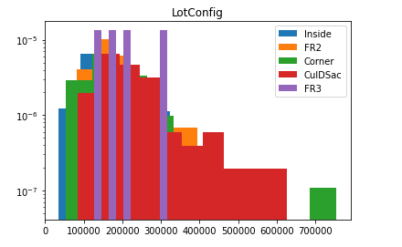
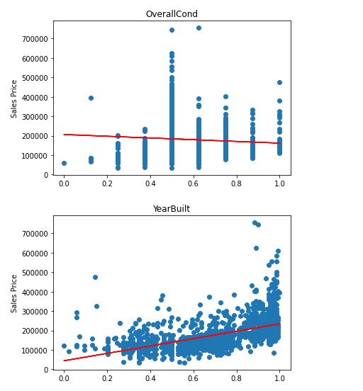

# House Prices - Advanced Regression Techniques  
  
In this github repository there's an attempt to use regression models handling multiple features with scikit learn to predict house prices from data like the square footage and condition of the home.  
  
### Overview  
  
**Description:** The aim of this project is to take data including 79 explanatory variables and predict the sales price of homes using regression techniques.  
**My Approach:** This task was a regression task, so I tested out four different scikit learn regression models to find one that performed well on the data.
**Summary of Performance Achieved**:  
  
### Summary of Work  
  
**Data:**  
* Two Datasets: train.csv and test.csv  
* Size: Both datasets together are about 912 kB  
* Description: Both datasets contain the same 79 explanatory variables along with the house id and the sales price of the home. Both datasets contain 1460 rows of data.  
  
**Cleaning and Preprocessing:**  
* After loading in the data, I made lists of the categorical column names and the numeric column names to make the data easier to work with.  
* Next I separated the house id and sales price columns from the dataset. House id was necessary to drop so that any models used wouldn't try to fit to that variable. Sales price was easier to separate as its own variable.  
* The next step was dealing with columns with NaN inputs. I found the columns which had close to a majority of NaN values and dropped those columns. I found the NaN columns for numeric variables and changed those NaN inputs to the median value for that column. I found the categorical NaN columns and changed those inputs to the mode for that column.  
* After clearing the NaN values in the dataset, I normalized the numeric data using scikit learn's MinMaxScaler. This set the numeric data on a scale from 0 to 1.  
* Lastly, I used pandas' get dummies function to turn each sub category for each categorical variable into its own variable with binary values. 0 if the row does not belong to that subcategory and 1 if it does.  

**Data Visualization:**  

  
  

  
### Problem Formulation  
  
**Input and Output**: For each of the four models I tried, the inputs were some set of variables from the 79 variables mentioned before. To arrive at which features to use and how many I used scikit learn's permutation importance function and wrote a loop that would test a range of those features to see which number of features performed the best.  
  
The output for each model is the predicted house prices from each model.  
  
**Models:**  Unsure of what to use going in, I looked for how to decide what regression models to use for datasets with so many variables and found a guide I'll like to below. I wanted to try linear and nonlinear models even though not much of the data appeared to have a linear relationship to the target variable.  
  
* SGDRegressor: This is scikit learn's stochastic gradient descent regression model. The main reason I tried this model was because it was a linear model that could handle many features. Scikit learn lists SGD's strengths as being efficient and easy to implement.  
* SVR: This is scikit learn's support vector regression model. It's one of the nonlinear models I tried. The guide I looked at said this was useful for data with large amounts unimportant features.
* ElasticNet: ElasticNet is a linear model with both l1 and l2 regularizers. It blends lasso and ridge regression. I used it because I wanted to do another linear model that would handle many features after the SVR model performed much worse than the SGD model.  
* ARDRegression: This is another linear model that does bayesian ridge regression with sparser weight values. It gives similar results to lasso regression while also not requiring as much work testing regularization term weights. I chose this model after trying the MLPRegressor and the most basic version of it scoring very badly.
* SGD and ARD performed the best of these models, both pretty similarly looking at the root mean squared error and r2 scores.  

**Loss, Optimizer, other Hyperparamaters:**  
  
* For the SGD model I tested the alternative functions and penalties listed in the documentation. Huber, epsilon insensitive, and squared epsilon insensitive were the function options. SEI performed the best and was the only alternative to perform well. It didn't perform better than the default squared mean function, though. Neither of the alternative penalties, l1 and elasticnet, made much of a difference.  
* For the SVR model, I tested the sigmoid and poly kernel settings to see if they were an improvement upon the default rbf kernel setting. Sigmoid didn't make much of a difference. Poly made the results much worse.  
* For all four models I used permutation importance from scikit learn to do feature selection. It scores features. I then tested various numbers of features selected from the best features to see how many features for each model was optimal. For SGD, it was between 30 and 40. For SVR, it was close to 20. For ElasticNet, the fewer the better. And for ARD it was about 20-25.  

### Training  
  
I loaded the data in with pandas' read csv function, went through the preprocessing process described above, and then I used train test split to split the training dataset I was provided 60/40. I then implemented four different models listed above, attempted to optimize the number of features I used, and tried a few different parameter settings to see if my results got better.  
  
I decided to stop training because I ran out of time. I would have tested a few different paramater settings. One of the main difficulties I ran into late in the process was how long it took to run some code. The loops to optimize for feature number and to test different settings could take very long to load. Eventually I couldn't keep trying and had to move to the next thing.  
  
Most of the other difficulties had more to do with the preprocessing process than the training process. Implementing the models I used was fairly simple other than what I just mentioned. It took a while to get the data ready by cleaning up NaN inputs and encoding my categorical data. Should have moved on from scikit learn's OneHotEncoder to pandas' get dummies sooner.  
  
### Performance Comparison  
  
The evaluation metric used for the Kaggle project was the root mean squared error, so that's one metric I used. RMSE is the square root of the mean squared error which is the mean of the squared errors, the differences between the predicted value and the actual value.  
  
The second metric I used was r2 because it's easier to look at and interpret. For RMSE, the lower the value, the better, but it's affected by the scale of the target variable, and because I was dealing with house prices, the scale of the target variable was large leading to large RMSE values. With r2 it's always between 0 and 1, and the closer to 1 it is the better.  
  
### Future Work  
  
The next thing I would do would be to look over the parameters for both ARD and SGD more closely because they're the models that performed the best, and run more tests on different parameter settings.  
  
### How to Reproduce Results  
* Download both training.csv and testing.csv from the House Prices Kaggle Project.
* Load in the data using pandas' read csv function.
* You'll need scikit learn, pandas, and numpy to reproduce results.
* Split columns into categorical and numeric and begin clearing NaN inputs. Code provided in the attached jupyter notebooks.
* Drop any columns which contain greater than 40% NaN inputs.
* Replace categorical NaN values with the mode outcome of the categorical variable and replace the numeric NaN values with the median outcome of the numeric variable.  
* Normalize numeric data with scikit learn's MinMaxScaler.
* Encode categorical variables making each subcategory its own category of binary inputs with pandas' get dummies function.
* Use scikit learn's train test split function to split the training dataset into training and testing data with a 60/40 ratio training to testing.
* The last thing to do is model implementation. My results, my final predictions, come from the SGDRegressor. Before implementing this model, use permutation importance to determine what features are best to include in the model.
* Once permutation importance has returned the variables best to include in the model, write a for loop that tests the model with a range of features included from those best features. The range I used was 5 to 60.  
* Once that's done, taking the testing dataset, test.csv, and separate out the house id numbers and sales prices and do the same data preprocessing as was done with the training dataset except for train test split.
* Then implement the SGD model and make predictions.  

### Citations  
  
* Guide for choosing a regression model: https://airtable.com/shrQ5rfksG64QobIy/tblkAQbukd3Al0OT6  
* Most everything else I used was scikit learn's documentation to follow how to implement different things, along with pandas and matplotlib documentation
